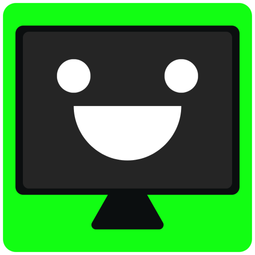
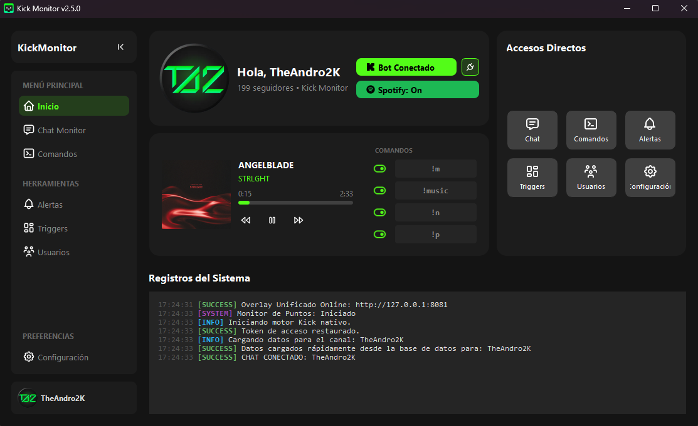
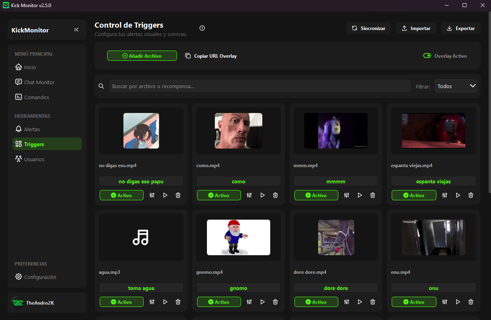
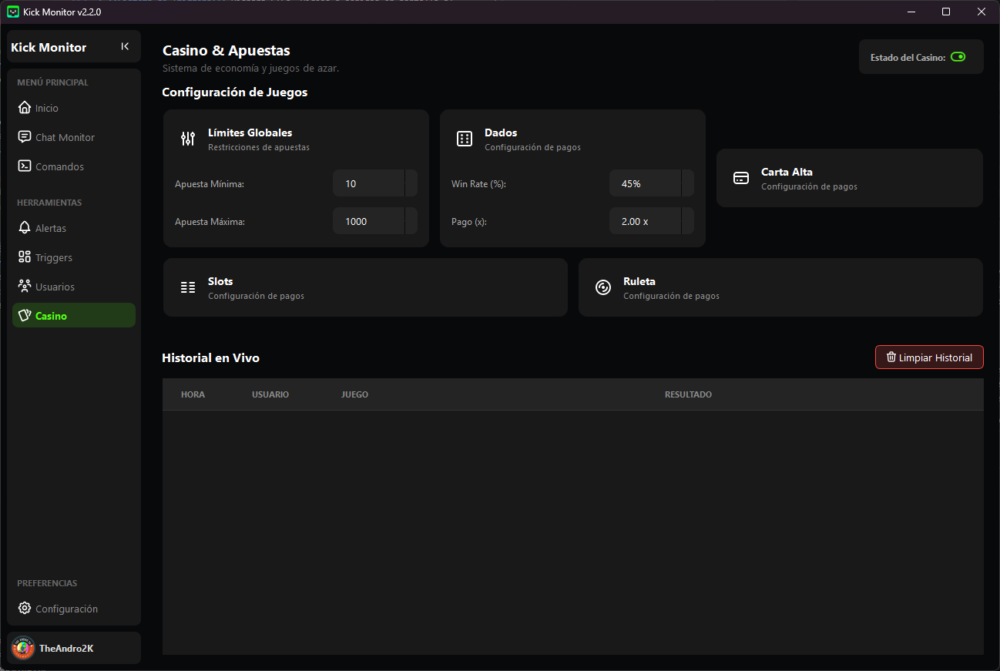

<div align="center">
  
  <h1>KickMonitor</h1>
  <p><strong>Solución integral de escritorio All-in-One para la gestión, automatización y overlays de streams en Kick.com</strong></p>

  <p>
    <a href="https://github.com/Andro2k/KickMonitor/releases/latest">
      
    </a>
    
    
    
  </p>
  <a href="https://github.com/Andro2k/KickMonitor/releases/latest">
    
  </a>
</div>

---

## Descripción General

**KickMonitor** es una aplicación de escritorio diseñada para centralizar absolutamente todas las herramientas esenciales de un streamer en la plataforma Kick. Desarrollada en Python con una interfaz gráfica moderna (PyQt6) y temática oscura, esta herramienta elimina la necesidad de tener múltiples pestañas del navegador abiertas y scripts dispersos consumiendo RAM.

El sistema combina el monitoreo de tu canal en tiempo real, un bot de chat súper rápido por WebSocket, un avanzado motor de Overlays Locales para OBS Studio, y un sistema de economía con minijuegos.

<div align="center">
  
  <br>
  <em>(Panel principal con estadísticas en tiempo real y control de Spotify)</em>
</div>

---

## Funcionalidades Principales

### Overlays Locales para OBS (¡NUEVO!)
Servidores web internos ultraligeros que transmiten directamente a tus fuentes de navegador de OBS:
* **Chat Pro Overlay (Puerto 6001):** Chat en pantalla 100% personalizable (burbujas, transparente, neón, horizontal), con animaciones de entrada/salida y renderizado de Emotes de Kick en alta calidad.
* **Alertas Visuales (Puerto 6002):** Alertas animadas en pantalla para Nuevos Seguidores, Suscripciones y Hosts/Raids. Funciona de forma totalmente independiente para evitar latencia.
* **Sistema de Triggers:** Dispara GIFs, videos o sonidos en pantalla al canjear recompensas o ejecutar comandos en el chat.

<div align="center">
  
</div>

### Chat Bot y Moderación Automática
* **Voces IA (Edge-TTS):** Text-to-Speech de altísima calidad para leer los mensajes del chat en vivo con acentos realistas.
* **Comandos Personalizados:** Crea respuestas dinámicas usando variables (`{user}`, `{points}`, `{random}`, etc.).
* **Filtros Inteligentes:** Píldoras de etiquetas interactivas (Tag Pills) para ignorar comandos de bots o silenciar usuarios molestos.
* **Timers:** Programa mensajes recurrentes para promocionar tus redes o servidor de Discord.

### Economía, Puntos y Casino
* **Sistema de Lealtad:** Otorga puntos automáticamente a los espectadores activos por cada mensaje o por tiempo de visualización.
* **Minijuegos Integrados:** Tragamonedas (`!slots`), Ruleta (`!roulette`) y Carta Alta (`!cartas`).
* **Sincronización Bidireccional:** Pausar, silenciar o banear usuarios desde la tabla de base de datos se refleja inmediatamente en el motor de lectura de voz y en la pantalla de OBS.

<div align="center">
  
</div>

---

## 📥 Instalación

### Para Usuarios de Windows (Recomendado)

1. Haz clic en el gran botón verde de arriba o ve a la pestaña de **[Lanzamientos (Releases)](https://github.com/Andro2k/KickMonitor/releases)**.
2. Descarga el ejecutable `KickMonitor_Setup_vX.X.X.exe`.
3. Instala la aplicación (creará un acceso directo en tu escritorio).
4. La aplicación incluye un **Actualizador Automático**, por lo que siempre tendrás las últimas novedades sin tener que volver a descargar instaladores.

### Para Desarrolladores (Código Fuente)

**Requisitos Previos:** `Python 3.12.10` y `Git`.

```bash
# 1. Clonar el repositorio
git clone [https://github.com/Andro2k/KickMonitor.git](https://github.com/Andro2k/KickMonitor.git)
cd KickMonitor
# 2. Crear y activar un entorno virtual
python -m venv venv
.\venv\Scripts\activate
# 3. Instalar dependencias
pip install -r requirements.txt
# 4. Ejecutar la aplicación
python main.py
```

## Configuración Básica

Para conectar el Bot a tu canal de Kick, ve a la pestaña **Ajustes** dentro de la app:

* **Kick OAuth:** Simplemente haz clic en "Conectar Bot" desde el Dashboard, se abrirá tu navegador para autorizar la conexión de forma segura (sin necesidad de contraseñas).
* **Spotify (Opcional):** Crea una app en *Spotify for Developers*, obtén tu Client ID y Client Secret para mostrar la música actual en tu stream.
* **OBS Studio:** Añade fuentes de navegador apuntando a `http://localhost:6001/chat` y `http://localhost:6002/alerts`. ¡Usa los botones "Copiar URL" dentro de KickMonitor para facilitar el proceso!

---

## Stack Tecnológico

* **Core & Backend:** Python 3.12.10, `asyncio`
* **Interfaz Gráfica (GUI):** PyQt6
* **WebSockets & Scraping:** `aiohttp`, `Pusher`, `cloudscraper`
* **Base de Datos:** SQLite (Sincronización segura con QMutexLocker)
* **Texto a Voz (TTS):** `edge-tts`, `pyttsx3`, `pygame`
* **Empaquetado:** PyInstaller y compilador Inno Setup 6

---

## Licencia

Este proyecto se distribuye bajo la licencia **MIT**. Consulte el archivo `LICENSE` para más detalles. Siéntete libre de clonarlo, modificarlo y contribuir con Pull Requests.

<div align="center">


<sub>Desarrollado con 💚 por <strong>TheAndro2K</strong></sub>
</div>