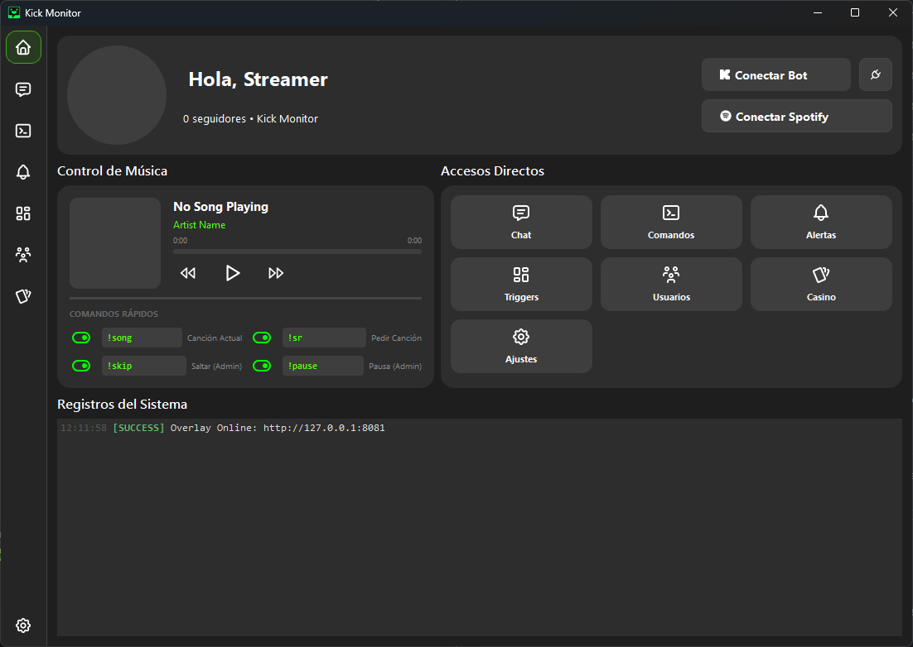

<div align="center">
  
  <h1>KickMonitor Bot</h1>
  <p>Solución integral de escritorio para gestión y automatización de streams en Kick.com</p>

  <p>
    <a href="https://github.com/Andro2k/KickMonitor/releases/latest">
      
    </a>
    
    
    
  </p>
</div>

---

## Descripción General

**KickMonitor** es una aplicación de escritorio diseñada para centralizar las herramientas esenciales de un streamer. Desarrollada en Python con una interfaz gráfica moderna basada en PyQt6, esta herramienta elimina la necesidad de múltiples pestañas de navegador y scripts dispersos.

El sistema combina monitoreo de estadísticas en tiempo real, un bot de chat modular con sistema de economía, integración multimedia con Spotify y un servidor local de overlays para alertas visuales y sonoras.



## Funcionalidades

### Gestión y Monitoreo
* **Panel de Control en Tiempo Real:** Visualización instantánea del estado del stream, contador de espectadores y detección de nuevos seguidores.
* **Actualizaciones Automáticas:** Sistema integrado que detecta, descarga y aplica nuevas versiones de la aplicación sin intervención manual compleja.

### Interacción y Chat Bot
* **Sistema de Comandos:** Comandos configurables (`!redes`, `!discord`) y respuestas personalizadas.
* **Economía y Fidelización:** Sistema de puntos automatizado por actividad en el chat y tiempo de visualización.
* **Protección de Chat:** Módulo Anti-Bot básico y filtros de moderación.
* **Lectura de Chat (TTS):** Integración de Text-to-Speech para lectura de mensajes en vivo.

### Entretenimiento y Minijuegos
* **Módulo de Casino:** Suite de juegos interactivos para el chat incluyendo Tragamonedas (`!slots`), Ruleta (`!roulette`) y Carta Alta.
* **Historial de Jugadas:** Registro visual en la interfaz de todas las apuestas y resultados.

### Integraciones Multimedia
* **Spotify:** Visualización de la canción actual en la interfaz y comando `!song` para el chat.
* **Overlay Local:** Servidor web interno para mostrar alertas visuales y reproducir sonidos en OBS (Browser Source).

## Instalación

### Para Usuarios Finales (Windows)

1.  Diríjase a la sección de **[Lanzamientos (Releases)](https://github.com/Andro2k/KickMonitor/releases)** de este repositorio.
2.  Descargue el ejecutable más reciente: `KickMonitor_Setup_vX.X.X.exe`.
3.  Ejecute el instalador y siga las instrucciones en pantalla.
4.  Al iniciar, la aplicación verificará la integridad de los archivos y creará la base de datos local necesaria.

### Para Desarrolladores

Si desea ejecutar el proyecto desde el código fuente o contribuir:

**Requisitos Previos**
* Python 3.10 o superior.
* Git.

**Pasos**

1.  Clonar el repositorio:
    ```bash
    git clone [https://github.com/Andro2k/KickMonitor.git](https://github.com/Andro2k/KickMonitor.git)
    cd KickMonitor
    ```

2.  Crear y activar un entorno virtual:
    ```bash
    python -m venv venv
    .\venv\Scripts\activate
    ```

3.  Instalar dependencias:
    ```bash
    pip install -r requirements.txt
    ```

4.  Ejecutar la aplicación:
    ```bash
    python main.py
    ```

## Configuración

Para el correcto funcionamiento de todas las características, es necesario configurar las credenciales en la pestaña **Ajustes**:

* **Kick:** Nombre de usuario y Slug del canal.
* **Spotify (Opcional):** Client ID y Client Secret (requerido para mostrar la música).
* **OBS:** Configurar la URL del Overlay proporcionada por la app en una fuente de navegador.

## Stack Tecnológico

* **Lenguaje:** Python 3.10+
* **Interfaz Gráfica:** PyQt6 (Qt Framework)
* **Base de Datos:** SQLite
* **Red y Peticiones:** Requests, QNetworkAccessManager
* **Empaquetado:** PyInstaller / Inno Setup

## Licencia

Este proyecto se distribuye bajo la licencia MIT. Consulte el archivo `LICENSE` para más detalles.

---
<div align="center">
  <sub>Desarrollado por Andro2k</sub>
</div>